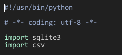
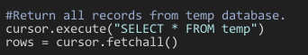

**OSF ****Operations**** Test - Process**

[GitHub](https://github.com/OregonShakespeareFestival/operations-test) - posted by [joelferrier](https://github.com/joelferrier)

submitted by: [Robert Luaders](https://github.com/RobertLuaders/operations-test)

October 4, 2015

**Excercise: ** [https://github.com/OregonShakespeareFestival/operations-test](https://github.com/OregonShakespeareFestival/operations-test)

**Initial Analysis:**

1. README.md is a "mark down" file opened with either
[http://www.sublimetext.com/](http://www.sublimetext.com/) or [https://atom.io/](https://atom.io/)
 The database needs to be reconciled with the input from the ERP.

2. employees.db is a database file opened with [SQLite Browser](https://github.com/sqlitebrowser/sqlitebrowser/releases/download/v3.6.0/sqlitebrowser-3.6.0.dmg) -:
2.a. **Database Structure: Table 1: employees; Table 2: test**

**2.b. Browse Employee Records**

3. **ERP Employee Data**: input.csv is a comma separated values file opened with MS Excel

    1. 108,000 rows with final "key" ‘**idnum’** entry is numbered 108,999

    2. malformed data: dictionary words like "Info-Management, Survey, Administrator, network-Ops, etc.; **‘givenName’** is sometimes a dictionary word: Glass

    3. malformed data: appended** ‘sn’** records: NTMVAA, NTACFB, INTMVAA, etc

    4. malformed data: garbage data appended **‘mail’ **

**Requirements / Language Choice / Deliverables:**

(employee changes) input.csv => (missing records added, some remove) employees.db

**Checklist of Requirements:**

1. Write a program that efficiently updates employees.db, such that the data in the database accurately reflects the data changes in input.csv.

2. 2.a. Any records present in input.csv that are missing from the database should be inserted, 2.b. and any "extra records" not in the database should be removed.

3. All records should be keyed on ID number.

4. It is not necessary to update any records with *changed* attributes.

5. All attributes are required, and any record with missing or empty fields should be considered *malformed*.

6. *Malformed* records should generate an exception, but should not halt the task.

7. All updates should be logged to an easily parsed log file.

8. Any language may be chosen that can be easily executed from source without manual compilation. ****Python****

9. Fork this repository on Github and create a new branch containing your solution. Solutions must be submitted by creating a pull request back into this repository.

**Synopsis:**

The data structure is challenging. Two important things are to sanitize strings and to use a dictionary for the sort. The choice of Python was because associative arrays are simpler than other interpreted languages. Also, [both](http://zetcode.com/db/sqlitepythontutorial/) the SQLite library and the pysqlitelanguage *binding are built into the Python language*. The hard part will be performing the updates based on keys. The input.csv file has 108,001 records and the employees.db has 100,000 records with a difference of 8,001 records.

**Code: **[https://github.com/RobertLuaders/operations-test/blob/master/reconcile.py](https://github.com/RobertLuaders/operations-test/blob/master/reconcile.py)

**Verified:**

**Commit: **

**GitHub: **[https://github.com/RobertLuaders/operations-test/commits/master](https://github.com/RobertLuaders/operations-test/commits/master)

**References:**

DictReader -  [https://docs.python.org/2/library/csv.html#csv.dictreader](https://docs.python.org/2/library/csv.html#csv.dictreader)

SQLite Python Tutorial - [http://zetcode.com/db/sqlitepythontutorial/](http://zetcode.com/db/sqlitepythontutorial/)

The Python Standard Library - [https://docs.python.org/2/library/](https://docs.python.org/2/library/)

Clarity Over Brevity in Variable and Method Names -  [https://signalvnoise.com/posts/3250-clarity-over-brevity-in-variable-and-method-names](https://signalvnoise.com/posts/3250-clarity-over-brevity-in-variable-and-method-names)**
**

**Texteditor: **Lighttable [http://lighttable.com/](http://lighttable.com/)
**Git Client:**  Sourcetree - [https://www.sourcetreeapp.com/](https://www.sourcetreeapp.com/)
**System:** Mac OS X version 10.7.5 - Peace Out :-)

______________________________________________________________________________________

# Operations Test

## Background

The file input.csv contains example employee records from an ERP system, which
is the authoritative source of employee data.  The file students.db is a SQLite
database that contains a set of employee records.  The database needs to be
reconciled with the input from the ERP.

## Requirements

Write a program that efficiently updates employees.db, such that the data in the
database accurately reflects the data changes in input.csv.  Any records present
in input.csv that are missing from the database should be inserted, and any
extra records not in the database should be removed. All records should be keyed
on ID number. It is not necessary to update any records with changed attributes.
All attributes are required, and any record with missing or empty fields should
be considered malformed. Malformed records should generate an exception, but
should not halt the task. All updates should be logged to an easily parsed log
file.

## Language choice

Any language may be chosen that can be easily executed from source without
manual compilation. These languages are sometimes called "interpreted"
languages, though the term is imprecise. Python, Ruby, Bash, Powershell, and
Haskell would all be good examples of interpreted languages by this definition.
There are many others. Java, C#, and C are languages where programs are
typically compiled by the programmer prior to execution, and therefore should be
avoided. Inlining code from a compiled language is allowed only if it is done
for a specific reason. If the program is submitted as a binary or needs to be
compiled prior to running, then it will be disqualified.

## Deliverables

Fork this repository on Github and create a new branch containing your solution.
Solutions must be submitted by creating a pull request back into this repository.
